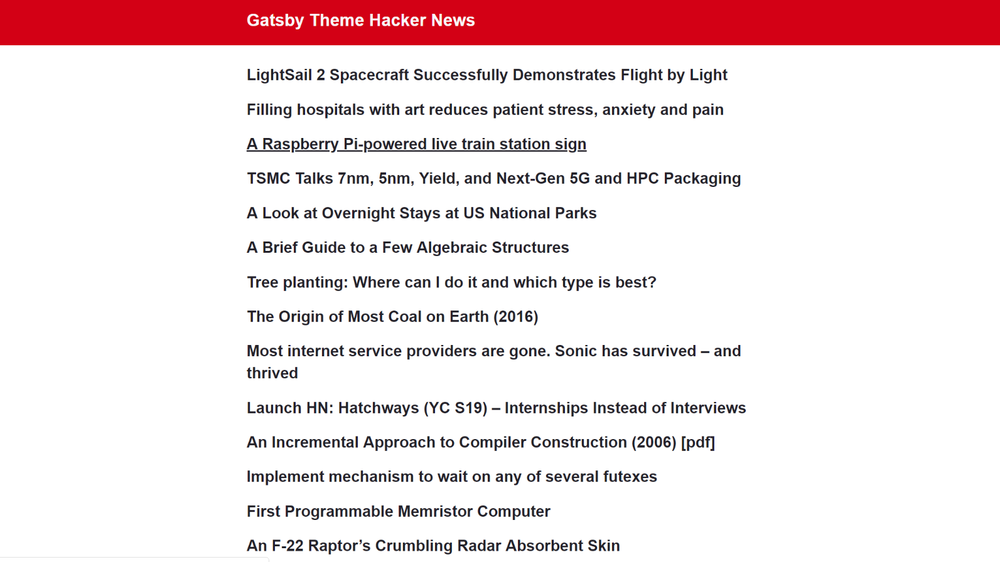

# Gatsby Theme Hacker News
- an elegant way to display linked headlines from Hacker News 
- option to display on styled MDX file

## This theme includes

- two components `<List />` and `<Headline />` to display Hacker News headlines on your site
- [gatsby-theme-mdx](https://www.gatsbyjs.org/packages/@horacioh/gatsby-theme-mdx/) configured inside this theme
- [gatsby-source-hacker-news](https://www.gatsbyjs.org/packages/gatsby-source-hacker-news/?=news) plugin

### Here's the [source code](https://github.com/will-sherman/gatsby-theme-hacker-news)
### Check out a [live demo](https://gatsby-theme-hacker-news.netlify.com/)

## Example:



## Installation

To use this theme in your Gatsby sites, follow these instructions:

1. Install the theme
```sh
npm install --save gatsby-theme-hacker-news
```

2. Add the theme to your `gatsby-config.js`:

```js
module.exports = {
  plugins: ["gatsby-theme-hacker-news"],
}
```

3. Start your site

```sh
gatsby develop
```

### To change the number of displayed headlines:
- create a [shadow component](https://www.gatsbyjs.org/blog/2019-04-29-component-shadowing/) `List.js`
- in the shadow component, splice the map function. For example, to display 11 results:  

```js
{data.allHnStory.edges.splice(0,11).map(({ node })
```

- alternately, modify the GraphQL query:

```js
allHnStory(sort: {fields: [order]}, limit: 11)
```
